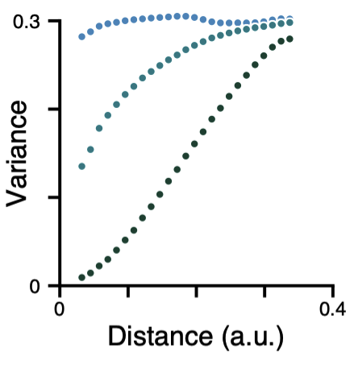
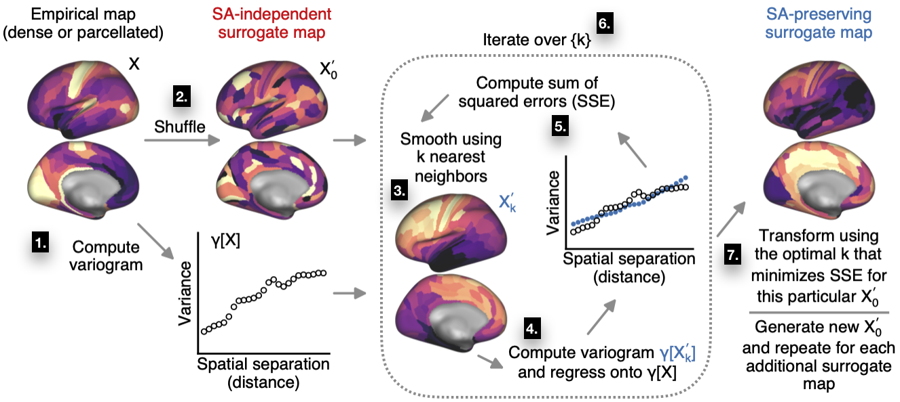

Approach
========

In BrainSMASH, spatial autocorrelation (SA) in brain maps is operationalized through the construction of a
`variogram <https://en.wikipedia.org/wiki/Variogram>`_:

   Variograms provide summary measures of pairwise variation as a function of distance.

The variogram quantifies, as a function of distance *d*, the variance between all pairs of points spatially separated by *d*.
Pure white noise, for example, which has equal variation across all spatial scales, has a flat variogram (i.e., no distance dependence).
Brain maps with very little SA will therefore have a variogram which is nearly flat, like the blue curve above. In contrast,
strongly autocorrelated brain maps exhibit less variation among spatially
proximal regions -- at small *d* -- than among widely separated regions, and are therefore
characterized by positive slopes in their variograms.
The brain map which produced the dark green curve above is therefore more autocorrelated than the
brain map which produced the cyan curve.
**To generate SA-preserving surrogate brain maps, BrainSMASH produces random maps whose
variograms are approximately matched to a target brain map's variogram.**

The figure below provides a schematic representation of the generative process implemented
in BrainSMASH:

   Generating spatial autocorrelation-preserving surrogate maps.

The algorithm consists of the following steps:

1. The variogram for the target brain map is computed. This is the target variogram for the output surrogate maps.
2. The empirical map is randomly permuted, breaking its spatial structure and randomizing its topography.
3. Spatial autocorrelation among the samples is reintroduced by smoothing the permuted map with a distance-dependent kernel. (By default, BrainSMASH uses an exponentially decaying kernel, but other options are :ref:`available <kernel>`.) Smoothing is performed using each region's *k* nearest neighboring regions. Different values of *k* correspond to differences in the characteristic length scale of the reintroduced SA.
4. The smoothed map's variogram is computed and then regressed onto the variogram for the empirical map. (The regression coefficients define the linear transformation of the smoothed map which approximately recovers the SA that is present in the target map.)
5. The goodness-of-fit is quantified by computing the sum of squared error (SSE) in the variogram fit.
6. Steps 3-5 are repeated, each time using a different number of nearest neighbors, *k*, to perform the spatial smoothing. (In BrainSMASH, *k* is parametrized as a fraction of the total number of regions; the set of values to iterate over may be specified by the user.)
7. The best value of *k*, which minimizes SSE, is used to generate a surrogate map whose SA is most closely matched to SA in the target map.

Steps 2-7 are repeated for each surrogate map. A more memory efficient implementation of the algorithm,
which utilizes random sampling and memory-mapped arrays, is described :ref:`here <dense>` and in the preprint:
in brief, steps 1 and 4 are performed on a random subset of brain areas, and the pairwise distance matrix is never loaded
entirely into memory.

The distance matrix can in theory be constructed using any distance measure. Here and in
the preprint, we use geodesic distance (i.e., distance along the cortical surface) for
cortical surface brain maps, and three-dimensional Euclidean distance for subcortical volumetric brain maps.
