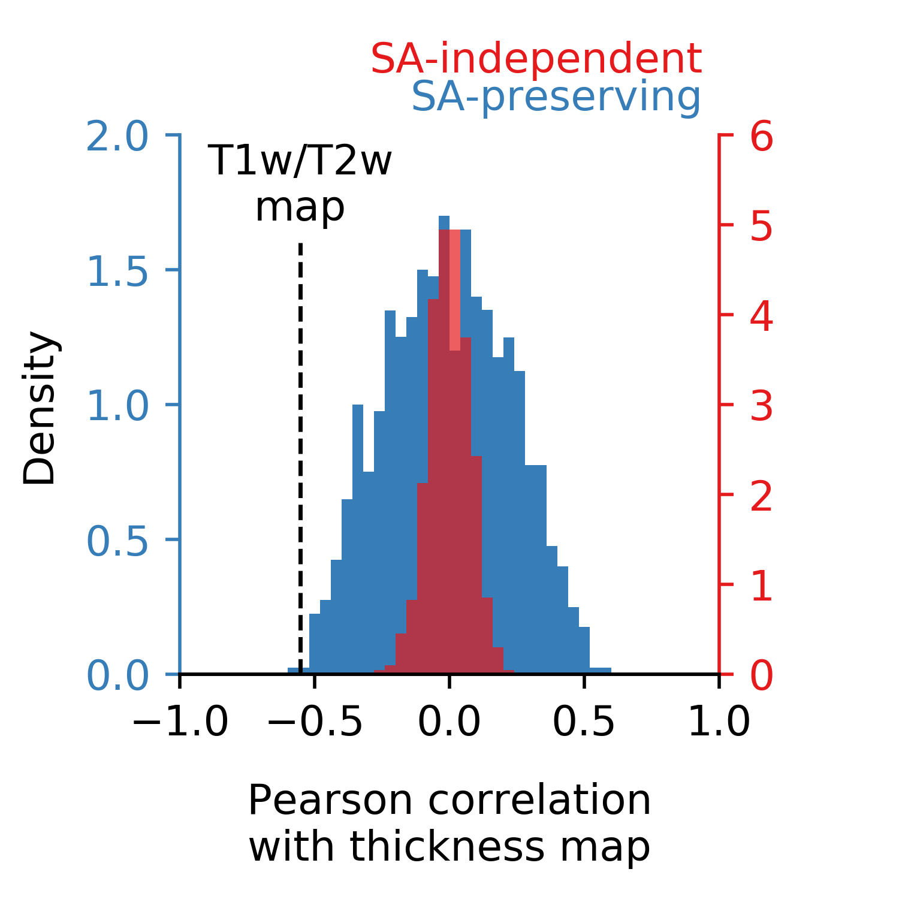
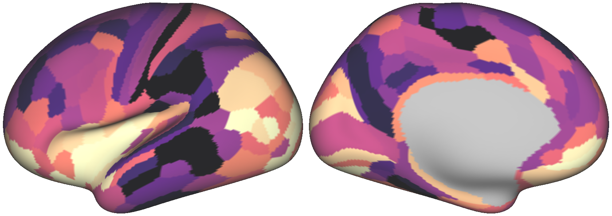
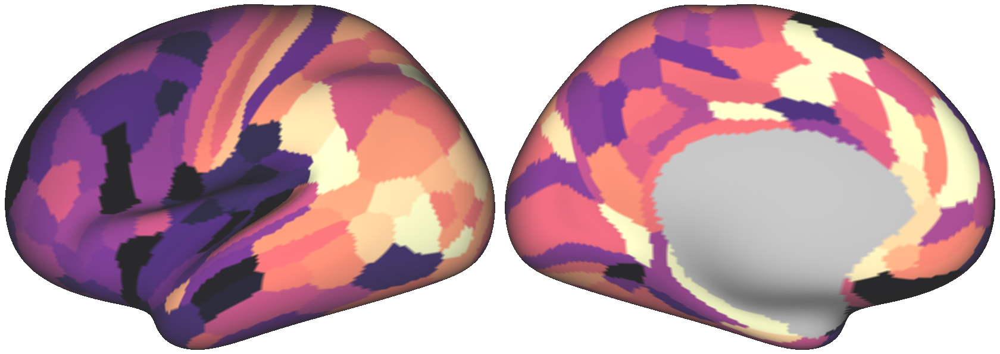
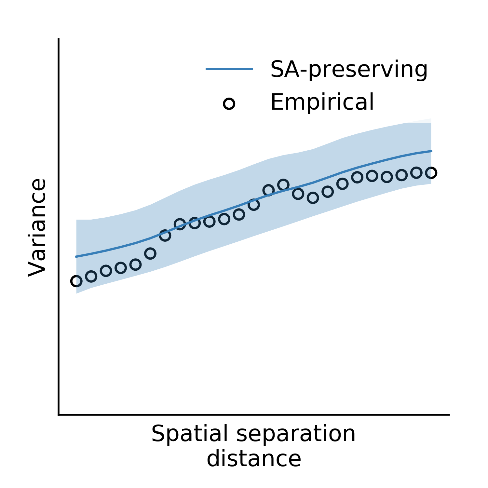

Example
=======

Here, we'll perform an analysis similar to those included in our pre-print (TODO), using the example
data we've included in the `BrainSMASH GitHub repo <https://github.com/jbburt/brainsmash/tree/master/examples>`_.

First, create an instance of the ``Base`` class and generate 1000 surrogate maps:

.. code-block:: python

        from brainsmash.mapgen.base import Base
        import numpy as np

        # load parcellated structural neuroimaging maps
        myelin = np.loadtxt("parcel_myelin.txt")
        thickness = np.loadtxt("parcel_thickness.txt")

        # instantiate class and generate 1000 surrogates
        gen = Base(myelin, "parcel_distmat.txt")  # accepts numpy arrays as well as filenames
        surrogate_maps = gen(n=1000)

Next, compute the Pearson correlation between each surrogate myelin map and the
empirical cortical thickness map:

.. code-block:: python

        from brainsmash.utils.stats import pearsonr, pairwise_r

        surrogate_brainmap_corrs = pearsonr(thickness, surrogate_maps).flatten()
        surrogate_pairwise_corrs = pairwise_r(surrogate_maps, flatten=True)

Repeat using randomly shuffled surrogate myelin maps:

.. code-block:: python

        naive_surrogates = np.array([np.random.permutation(myelin) for _ in range(1000)])
        naive_brainmap_corrs = pearsonr(thickness, naive_surrogates).flatten()
        naive_pairwise_corrs = pairwise_r(naive_surrogates, flatten=True)

Now plot the results:

.. code-block:: python

    import matplotlib.pyplot as plt
    from scipy import stats

    sac = '#377eb8'  # autocorr-preserving
    rc = '#e41a1c'  # randomly shuffled
    bins = np.linspace(-1, 1, 51)  # correlation bins

    # this is the empirical statistic we're creating a null distribution for
    test_stat = stats.pearsonr(myelin, thickness)[0]

    fig = plt.figure(figsize=(3, 3))
    ax = fig.add_axes([0.2, 0.25, 0.6, 0.6])  # autocorr preserving
    ax2 = ax.twinx()  # randomly shuffled

    # plot the data
    ax.axvline(test_stat, 0, 0.8, color='k', linestyle='dashed', lw=1)
    ax.hist(surrogate_brainmap_corrs, bins=bins, color=sac, alpha=1,
        density=True, clip_on=False, zorder=1)
    ax2.hist(naive_brainmap_corrs, bins=bins, color=rc, alpha=0.7,
        density=True, clip_on=False, zorder=2)

    # make the plot nice...
    ax.set_xticks(np.arange(-1, 1.1, 0.5))
    ax.spines['left'].set_color(sac)
    ax.tick_params(axis='y', colors=sac)
    ax2.spines['right'].set_color(rc)
    ax2.tick_params(axis='y', colors=rc)
    ax.set_ylim(0, 2)
    ax2.set_ylim(0, 6)
    ax.set_xlim(-1, 1)
    [s.set_visible(False) for s in [
        ax.spines['top'], ax.spines['right'], ax2.spines['top'], ax2.spines['left']]]
    ax.text(0.97, 1.1, 'SA-independent', ha='right',va='bottom',
        color=rc, transform=ax.transAxes)
    ax.text(0.97, 1.03, 'SA-preserving', ha='right', va='bottom',
        color=sac, transform=ax.transAxes)
    ax.text(test_stat, 1.65, "T1w/T2w\nmap", ha='center', va='bottom')
    ax.text(0.5, -0.2, "Pearson correlation\nwith thickness map",
        ha='center', va='top', transform=ax.transAxes)
    ax.text(-0.3, 0.5, "Density", rotation=90, ha='left', va='center', transform=ax.transAxes)
    plt.show()

Executing the above code produces the following figure:

   The spatial autocorrelation-preserving surrogate map-informed null distribution is shown in blue.'

We can plot a couple surrogate maps on the cortical surface using `wbplot <https://github.com/jbburt/wbplot>`_:

.. code-block:: python

    from wbplot import pscalar

    def vrange(x):
        return (np.percentile(x, 5), np.percentile(x, 95))

    for i in range(3):
        y = surrogate_maps[i]
        pscalar(
            file_out="surrogate_{}".format(i+1),
            pscalars=y,
            orientation='landscape',
            hemisphere='left',
            vrange=vrange(y),
            cmap='magma')

Executing the above code produces the following three images:

.. figure::  images/surrogate_2.png
   :align:   center
   :scale: 25 %

We'll assess our surrogate maps' reliability using their fit to the
parcellated T1w/T2w map's variogram:

.. code-block:: python

   from brainsmash.utils.eval import base_fit

   base_fit(
       brain_map="parcel_myelin.txt",
       distmat="parcel_distmat.txt",
       nsurr=1000,
       nbins=25,  # these are default kwargs, but shown here for demonstration
       deltas=np.arange(0.1, 1, 0.1),
       umax=25)  # kwargs are passed to brainsmash.mapgen.base.Base

Executing the code above produces the following plot:

   Surrogate maps have the same autocorrelation structure as the empirical brain map.

Finally, we'll compute non-parametric P-values using our two different
null distributions:

.. code-block:: python

   from brainsmash.utils.stats import nonparp

   print("Spatially naive P-value:", nonparp(test_stat, naive_brainmap_corrs))
   print("SA-corrected P-value:", nonparp(test_stat, surrogate_brainmap_corrs))

The two P-values for this example come out to ``P < 0.001`` and ``P=0.001``, respectively.