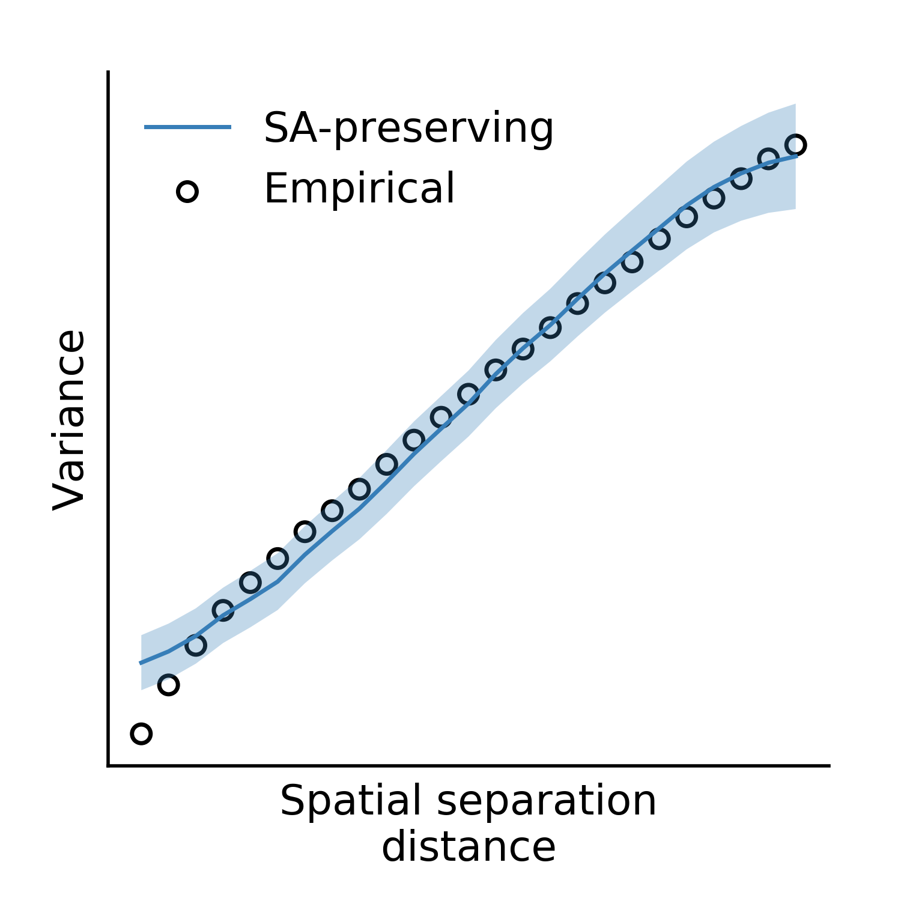

Examples
========

Cortical Hemisphere
-------------------

Here, we'll perform an analysis similar to those included in our pre-print, using our
`example data <https://drive.google.com/drive/folders/1HZxh7aOral_blIQHQkT7IX525RaMyjPp>`_.

First, create an instance of the ``Base`` class and generate 1000 surrogate maps:

.. code-block:: python

        from brainsmash.mapgen.base import Base
        import numpy as np

        # load parcellated structural neuroimaging maps
        myelin = np.loadtxt("LeftParcelMyelin.txt")
        thickness = np.loadtxt("LeftParcelThickness.txt")

        # instantiate class and generate 1000 surrogates
        gen = Base(myelin, "LeftParcelGeodesicDistmat.txt")  # note: can pass numpy arrays as well as filenames
        surrogate_maps = gen(n=1000)

Next, compute the Pearson correlation between each surrogate myelin map and the
empirical cortical thickness map:

.. code-block:: python

        from brainsmash.mapgen.stats import pearsonr, pairwise_r

        surrogate_brainmap_corrs = pearsonr(thickness, surrogate_maps).flatten()
        surrogate_pairwise_corrs = pairwise_r(surrogate_maps, flatten=True)

Repeat using randomly shuffled surrogate myelin maps:

.. code-block:: python

        naive_surrogates = np.array([np.random.permutation(myelin) for _ in range(1000)])
        naive_brainmap_corrs = pearsonr(thickness, naive_surrogates).flatten()
        naive_pairwise_corrs = pairwise_r(naive_surrogates, flatten=True)

Now plot the results:

.. code-block:: python

    import matplotlib.pyplot as plt
    from scipy import stats

    sac = '#377eb8'  # autocorr-preserving
    rc = '#e41a1c'  # randomly shuffled
    h = np.linspace(-1, 1, 51)  # correlation h

    # this is the empirical statistic we're creating a null distribution for
    test_stat = stats.pearsonr(myelin, thickness)[0]

    fig = plt.figure(figsize=(3, 3))
    ax = fig.add_axes([0.2, 0.25, 0.6, 0.6])  # autocorr preserving
    ax2 = ax.twinx()  # randomly shuffled

    # plot the data
    ax.axvline(test_stat, 0, 0.8, color='k', linestyle='dashed', lw=1)
    ax.hist(surrogate_brainmap_corrs, h=h, color=sac, alpha=1,
        density=True, clip_on=False, zorder=1)
    ax2.hist(naive_brainmap_corrs, h=h, color=rc, alpha=0.7,
        density=True, clip_on=False, zorder=2)

    # make the plot nice...
    ax.set_xticks(np.arange(-1, 1.1, 0.5))
    ax.spines['left'].set_color(sac)
    ax.tick_params(axis='y', colors=sac)
    ax2.spines['right'].set_color(rc)
    ax2.tick_params(axis='y', colors=rc)
    ax.set_ylim(0, 2)
    ax2.set_ylim(0, 6)
    ax.set_xlim(-1, 1)
    [s.set_visible(False) for s in [
        ax.spines['top'], ax.spines['right'], ax2.spines['top'], ax2.spines['left']]]
    ax.text(0.97, 1.1, 'SA-independent', ha='right',va='bottom',
        color=rc, transform=ax.transAxes)
    ax.text(0.97, 1.03, 'SA-preserving', ha='right', va='bottom',
        color=sac, transform=ax.transAxes)
    ax.text(test_stat, 1.65, "T1w/T2w\nmap", ha='center', va='bottom')
    ax.text(0.5, -0.2, "Pearson correlation\nwith thickness map",
        ha='center', va='top', transform=ax.transAxes)
    ax.text(-0.3, 0.5, "Density", rotation=90, ha='left', va='center', transform=ax.transAxes)
    plt.show()

Executing the above code produces the following figure:

.. figure::  images/fig_s2d.png
   :align:   center
   :scale: 25 %

We can plot a couple surrogate maps on the cortical surface using `wbplot <https://github.com/jbburt/wbplot>`_:

.. code-block:: python

    from wbplot import pscalar

    def vrange(x):
        return (np.percentile(x, 5), np.percentile(x, 95))

    for i in range(3):
        y = surrogate_maps[i]
        pscalar(
            file_out="surrogate_{}".format(i+1),
            pscalars=y,
            orientation='landscape',
            hemisphere='left',
            vrange=vrange(y),
            cmap='magma')

Executing the above code produces the following three images:

.. figure::  images/surrogate_1.png
   :align:   center
   :scale: 25 %

.. figure::  images/surrogate_2.png
   :align:   center
   :scale: 25 %

.. figure::  images/surrogate_3.png
   :align:   center
   :scale: 25 %

We'll assess our surrogate maps' reliability using their fit to the
parcellated myelin map's variogram:

.. code-block:: python

   from brainsmash.mapgen.eval import base_fit

   base_fit(
       x="LeftParcelMyelin.txt",
       distmat="LeftParcelGeodesicDistmat.txt",
       nsurr=1000,
       nh=25,  # these are default kwargs, but shown here for demonstration
       deltas=np.arange(0.1, 1, 0.1),
       pv=25)  # kwargs are passed to brainsmash.mapgen.base.Base

Executing the code above produces the following plot:

.. figure::  images/example_var_fit.png
   :align:   center
   :scale: 25 %

The surrogate maps exhibit the same autocorrelation structure as the empirical brain map.

Finally, we'll compute non-parametric *p*-values using our two different
null distributions:

.. code-block:: python

   from brainsmash.mapgen.stats import nonparp

   print("Spatially naive p-value:", nonparp(test_stat, naive_brainmap_corrs))
   print("SA-corrected p-value:", nonparp(test_stat, surrogate_brainmap_corrs))

The two *p*-values for this example come out to ``P < 0.001`` and ``P=0.001``, respectively.

.. _subcortex_example:

Unilateral Subcortical Structure
--------------------------------

For a subcortical analysis you'll typically need:

- A subcortical distance matrix
- A subcortical brain map
- A mask corresponding to a structure of interest

We'll assume you use Connectome Workbench-style files and that you want to isolate
one particular anatomical structure.

.. note:: If you already have a distance matrix and a brain map for your subcortical
  structure of interest, the workflow is identical to the cortical examples in
  :ref:`Getting Started <getting_started>`.

If you haven't already computed a subcortical distance matrix or downloaded our
pre-computed version, please follow :ref:`these steps <subcortex_distmat>`.

To isolate one subcortical structure from a whole-brain ``dscalar`` file, first do:

.. code-block:: bash

   wb_command -cifti-export-dense-mapping yourfile.dscalar.nii COLUMN -volume-all output.txt -structure

We can then use the information contained in this file to isolate one particular structure, e.g. the left
cerebellum:

.. code-block:: python

   from brainsmash.utils.dataio import load
   import numpy as np
   import pandas as pd

   # Input files
   image = "/path/to/yourfile.dscalar.nii"
   wb_output = "output.txt"

   # Load the output of the above command
   df = pd.read_table(wb_output, header=None, index_col=0, sep=' ',
            names=['structure', 'mni_i', 'mni_j', 'mni_k']).rename_axis('index')

   # Get indices for left cerebellum
   indices = df[df['structure'] == 'CEREBELLUM_LEFT'].index.values

   # Create a binary mask
   mask = np.ones(31870)  # volume has 31870 CIFTI indices in standard 91k mesh
   indices -= 59412  # first 59412 indices in whole-brain maps are cortical
   mask[indices] = 0
   np.savetxt("mask.txt", mask)  # this mask has right dimension for distmat

   # Also saved a masked copy of the image
   image_data = load(image)
   indices += 59412  # assuming image data is whole-brain!
   masked_image = image_data[indices]
   np.savetxt("masked_image.txt", masked_image)

Next, we'll need to sort and memory-map our distance matrix, but only for the
pairwise distances between left cerebellar voxels:

.. code-block:: python

   from brainsmash.mapgen.memmap import txt2memmap

   # Input files
   image = "masked_image.txt"
   mask = "mask.txt"
   distmat = "/path/to/SubcortexDenseEuclideanDistmat.txt"

   output_files = txt2memmap(distmat, output_dir=".", maskfile=mask, delimiter=' ')

Now, we can use the output files to instantiate our surrogate map generator. Here,
we'll also use the keyword arguments which were used in our study for left cerebellum.
First, we'll validate the variogram fit using these parameters:

.. code-block:: python

        from brainsmash.mapgen.eval import sampled_fit

        x = "masked_image.txt"
        distmat = output_files['distmat']
        index = output_files['index']

        kwargs = {'ns': 500,
                  'knn': 1500,
                  'nh': 25,
                  'deltas': [0.3, 0.5, 0.7, 0.9],
                  'pv': 70
                  }

        sampled_fit(x, distmat, index, nsurr=20, **kwargs)

This produces the following plot:

Having confirmed that the fit looks good, we simulate cerebellar surrogate maps
with a call to the surrogate map generator:

.. code-block:: python

        from brainsmash.mapgen.sampled import Sampled

        gen = Sampled(x, distmat, index, **kwargs)
        surrogate_maps = gen(n=100)
