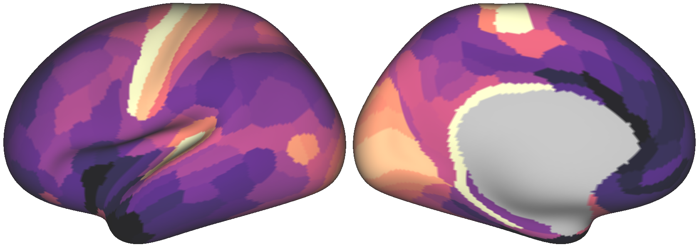
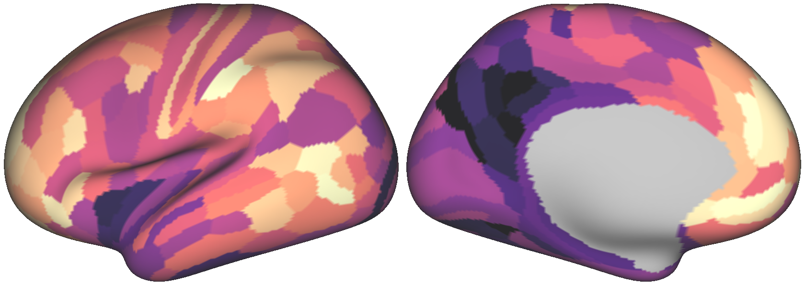
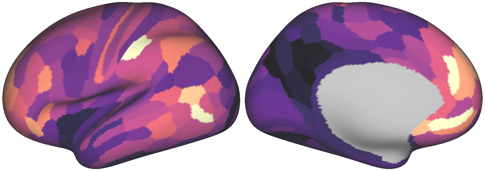
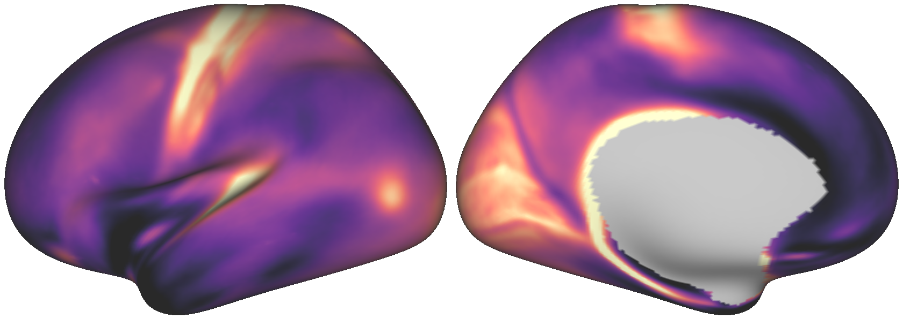
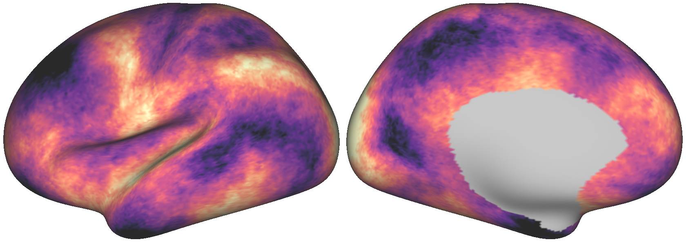
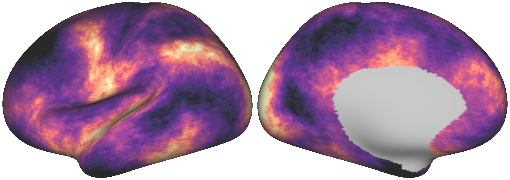
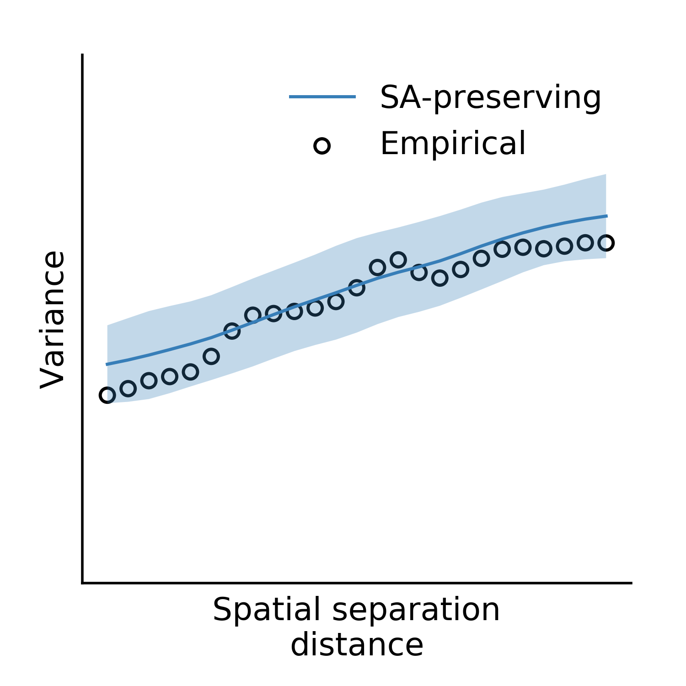

.. _getting_started:

Getting Started
===============

Input data types
----------------
Using BrainSMASH requires specifying two inputs:

- A brain map, i.e. a one-dimensional scalar vector, and
- A distance matrix, containing a measure of distance between each pair of elements in the brain map

For illustration's sake, we will assume both required arguments have been written
to disk as whitespace-separated text files ``LeftParcelMyelin.txt`` and ``LeftParcelGeodesicDistmat.txt``.
However, BrainSMASH can flexibly accommodate a variety of input types:

- Delimited ``*.txt`` files
- Neuroimaging files used by Connectome Workbench, including ``*scalar.nii`` files and ``*.func.gii`` metric files (assuming the files contain only a single brain map)
- Data and memory-mapped arrays written to ``*.npy`` files
- Numpy arrays and array-like objects

To follow along with the examples below, you can download our `example data <https://drive.google.com/open?id=1HZxh7aOral_blIQHQkT7IX525RaMyjPp>`_.
Connectome Workbench users who wish to derive a distance matrix from a ``*.surf.gii``
file may want to begin :ref:`below <wb>`, as these functions take a long time to run
(but thankfully only ever need to be run once).

Parcellated surrogate maps
--------------------------
For this example, we'll make the additional assumption that ``LeftParcelMyelin.txt`` contains
myelin map values for 180 unilateral cortical parcels, and that ``LeftParcelGeodesicDistmat.txt`` is
a 180x180 matrix containing the pairwise geodesic distances between parcels.

Because working
with parcellated data is not computationally expensive, we'll import the :class:`brainsmash.mapgen.base.Base`
class (which does not utilize random sampling):

.. code-block:: python

        from brainsmash.mapgen.base import Base
        brain_map_file = "LeftParcelMyelin.txt"  # use absolute paths if necessary!
        dist_mat_file = "LeftParcelGeodesicDistmat.txt"

Note that if the two text files are not in the current directory, you'll need to
include the absolute paths to the files in the variables defined above.

We'll create an instance of the class, passing our two files as arguments
(implicitly using the default values for the optional keyword arguments):

.. code-block:: python

        base = Base(brain_map=brain_map_file, distmat=dist_mat_file)

Surrogate maps can then be generated with a call to the class instance:

.. code-block:: python

        surrogates = base(n=1000)

where ``surrogates`` is a numpy array with shape ``(1000,180)``. The empirical
brain map and one of the surrogate maps are illustrated side-by-side below for
comparison:

   The empirical T1w/T2w map.

   One randomly generated surrogate map.

By construction, both maps exhibit the same degree of spatial autocorrelation
in their values. However, notice that the empirical brain map has a distribution
of values more skewed towards higher values, indicated by dark purple. If you wish
to generate surrogate maps which preserve (identically) the distribution of values
in the empirical map, use the keyword argument ``resample`` when instantiating
the class:

.. code-block:: python

   base = Base(brain_map=brain_map_file, distmat=dist_mat_file, resample=True)

The surrogate map illustrated above, had it been generated using ``resample=True``,
is shown below for comparison:

  The surrogate brain map above, with values resampled from the empirical map.

Note that using ``resample=True`` will in general reduce the degree to which the
surrogate maps' autocorrelation matches the autocorrelation in the empirical map.
However, this discrepancy tends to be small for parcellated brain maps, and tends
to be larger for brain maps whose values are more strongly non-normal.

.. note:: Shameless plug: the plots above
  were auto-generated using our ``wbplot`` package, available through both `pip <https://pypi.org/project/wbplot/>`_
  and `GitHub <https://github.com/jbburt/wbplot>`_. ``wbplot`` currently only
  supports cortical data, and parcellated data must be in the `HCP's MMP parcellation <https://balsa.wustl.edu/study/show/RVVG>`_.

Keyword arguments to :class:`brainsmash.mapgen.base.Base`
+++++++++++++++++++++++++++++++++++++++++++++++++++++++++

.. _deltas:

``deltas`` np.ndarray or list[float], default [0.1,0.2,..,0.9]
   The proportion of neighbors to include during the smoothing step, in the interval (0, 1]. This parameter specifies the different smoothing neighborhood sizes which are iterated over during the variogram optimization.

.. _kernel:

``kernel`` str, default 'exp'
  The functional form of the smoothing kernel:

  - ’gaussian’ : Gaussian function
  - ‘exp’ : Exponential decay function
  - ‘invdist’ : Inverse distance
  - ‘uniform’ : Uniform weights (distance independent)

.. _umax:

``umax`` int, default 25
  Percentile of the pairwise distance distribution at which to truncate during variogram fitting. The inclusion of this parameter is motivated by the fact that at large distances, pairwise variability is primarily driven by noise.

.. _nbins:

``nbins`` int, default 25
  The number of uniformly spaced distance intervals within which to compute variance when constructing variograms. This parameter governs the granularity of your variogram. For noisy brain maps, this parameter should be small enough such that the variogram is smooth and continuous.

.. _resample:

``resample`` bool, default False
  Resample surrogate maps’ values from empirical brain map, to preserve the distribution of values in each surrogate map. This may produce surrogate maps with poorer fits to the empirical map's variogram.

.. _bw:

``h`` float or None, default None
  The bandwidth of the Gaussian kernel used to smooth the variogram. The variogram isn't particularly sensitive to this parameter, but it's included anyways. If this parameter is None, by default the bandwidth is set to three times the variogram distance interval (see ``nbins`` above).

.. _dense:

Dense surrogate maps
--------------------
Next, we'll demonstrate how to use BrainSMASH to generate surrogate maps for
dense (i.e., vertex- or voxel-wise) empirical brain maps, which is a little
more tricky. Dense-level data are problematic because of their memory burden ---
a pairwise distance matrix for data in standard 32k resolution requires more than
4GB of memory if read in all at once from file.

To circumvent these memory issues, we've developed a second core implementation
which utilizes memory-mapped arrays and random sampling to avoid loading all of the
data into memory at once. However, users with sufficient memory resources and/or
supercomputer access are encouraged to use the ``Base`` implementation described
above.

Again, we'll assume that the user already has a brain map and distance matrix saved
locally as text files (or downloaded from `here <https://drive.google.com/open?id=1HZxh7aOral_blIQHQkT7IX525RaMyjPp>`_).

.. _memmap:

Creating memory-mapped arrays
+++++++++++++++++++++++++++++

Prior to simulating surrogate maps, you'll need to convert
the distance matrix to a memory-mapped binary file, which can be easily achieved
in the following way:

.. code-block:: python

   from brainsmash.mapgen.memmap import txt2memmap
   dist_mat_fin = "LeftDenseGeodesicDistmat.txt"  # input text file
   output_dir = "."               # directory to which output binaries are written
   output_files = txt2memmap(dist_mat_fin, output_dir, maskfile=None, delimiter=' ')

The latter two keyword arguments are shown using their default values. If your
text files are comma-delimited, for example, use ``delimiter=','`` instead. Moreover, if
you wish to use only a subset of all brain regions, you may also specify a mask
(as a path to a neuroimaging file) using the ``maskfile`` argument.

The return value ``output_files`` in the code block above is a ``dict`` type object
that will look something like:

.. code-block:: python

   output_files = {'distmat': '/pathto/output_dir/distmat.npy',
                   'index': '/pathto/output_dir/index.npy'}

These two files are required inputs to the :class:`brainsmash.mapgen.sampled.Sampled` class.

.. note:: For additional computational speed-up, ``distmat.npy`` is sorted by
  :func:`brainsmash.mapgen.memmap.txt2memmap` before it is written to file; the second file, ``index.npy``, is required because it contains
  the indices which were used to sort the distance matrix.

This text to memory-mapped array conversion only ever needs to be run once for a given
distance matrix.

Finally, to generate surrogate maps, we import the :class:`brainsmash.mapgen.sampled.Sampled` class
and create an instance by passing our brain map, memory-mapped distance matrix, and
memory-mapped index file as arguments:

.. code-block:: python

        from brainsmash.mapgen.sampled import Sampled
        brain_map_file = "LeftDenseMyelin.txt"  # use absolute paths if necessary!
        dist_mat_mmap = output_files['distmat']
        index_mmap = output_files['index']
        sampled = Sampled(brain_map_file, dist_mat_mmap, index_mmap)

We then randomly generate surrogate maps with a call to the class instance:

.. code-block:: python

        surrogates = sampled(n=10)

Here, as above, we've implicitly left all keyword arguments -- one of which is ``resample`` --
left as their default values. The three images analogous to those shown above, illustrating the
dense maps on the cortical surface, are shown below:

   The dense empirical T1w/T2w map.

   One randomly generated dense surrogate brain map.

  The dense surrogate brain map above, with values resampled from the empirical map.

Keyword arguments to :class:`brainsmash.mapgen.sampled.Sampled`
+++++++++++++++++++++++++++++++++++++++++++++++++++++++++++++++

``ns`` int, default 500
  The number of randomly sampled brain areas used to generate a surrogate map.

``knn`` int, default 1000
  Let **D** be the pairwise distance matrix. Assume each row of **D** has been sorted, in ascending order. Then, because spatial autocorrelation is primarily a local effect, use only **D[:,:knn]**.

``deltas`` np.ndarray or list[float], default [0.3,0.5,0.7,0.9]
   See :ref:`above <deltas>`. Note that fewer values are iterated over by default than in the ``Base`` class. Users with more time and/or patience are encouraged to expand the default list, as it may improve your surrogate maps.

``kernel`` str, default 'exp'
   See :ref:`above <kernel>`.

``umax`` int, default 70
  See :ref:`above <umax>`. Note that this parameter is by default larger than for the ``Base`` class; this is in part because of the ``knn`` parameter above (which is used internally to reduce the distance matrix prior to determining ``umax``.

``nbins`` int, default 25
  See :ref:`above <nbins>`.

``resample`` bool, default False
   See :ref:`above <resample>`.

``h`` float or None, default None
   See :ref:`above <bw>`.

.. note:: Dense data may be used with :class:`brainsmash.mapgen.base.Base` -- the examples are primarily partitioned in this way for illustration (but also in anticipation of users' local memory constraints).

In general, the ``Sampled`` class has much more parameter sensitivity. You may need to adjust
these parameters to get reliable variogram fits. However, you may use the functions in the :ref:`eval <pysec-mapgen-eval>` module, which we turn to next,
to validate your variogram fits.

Evaluating variogram fits
-------------------------
To assess the reliability of your surrogate maps, BrainSMASH includes functionality to
compare surrogate maps' variograms to the target brain map's variogram:

.. code-block:: python

   from brainsmash.mapgen.eval import base_fit
   # from brainsmash.utils.eval import sampled_fit  analogous function for Sampled class
   base_fit(brain_map_file, dist_mat_file, nsurr=100)

For well-chosen parameters, the code above will produce a plot that looks something like:

   Assessing the surrogate maps' fit to the empirical data.

Shown above is the mean and standard deviation across 100 surrogates. Optional
keyword arguments for :class:`brainsmash.mapgen.base.Base` and :class:`brainsmash.mapgen.sampled.Sampled` can be specified after ``nsurr`` in
the function calls to :func:`brainsmash.mapgen.eval.base_fit` and :func:`brainsmash.mapgen.eval.sampled_fit`-- for example, if
you want to assess how changing the other parameters influences your surrogates maps' variogram fits.

.. note:: When using :func:`brainsmash.mapgen.eval.sampled_fit`, you must specify the memory-mapped ``index`` file in addition to the brain map and distance matrix files (see :ref:`above <memmap>`).

Workbench users
---------------
The functionality described below is intended for users using `GIFTI- and CIFTI-format <https://balsa.wustl.edu/about/fileTypes>`_ surface-based neuroimaging files.

Neuroimaging data I/O
+++++++++++++++++++++
To load data from a neuroimaging file into Python, you may use :func:`brainsmash.utils.dataio.load`. For example:

.. code-block:: python

   from brainsmash.utils.dataio import load
   f = "/path/to/myimage.dscalar.nii"
   brain_map = load(f)  # type(brain_map) == numpy.ndarray

.. _wb:

Computing a cortical distance matrix
++++++++++++++++++++++++++++++++++++
To construct a geodesic distance matrix for a cortical hemisphere, you can do the following:

.. code-block:: python

   from brainsmash.workbench.geo import cortex
   surface = "/path/to/S1200.L.midthickness_MSMAll.32k_fs_LR.surf.gii"
   cortex(surface=surface, outfile="/pathto/dense_geodesic_distmat.txt", euclid=False)

Note that this function takes approximately two hours to run for standard 32k surface meshes. To compute 3D
Euclidean distances instead of surface-based geodesic distances, simply pass ``euclid=True``.

To compute a parcellated geodesic distance matrix, you could then do:

.. code-block:: python

   from brainsmash.workbench.geo import parcellate
   infile = "/path/to/dense_geodesic_distmat.txt"
   outfile = "/path/to/parcel_geodesic_distmat.txt"
   dlabel = "Q1-Q6_RelatedValidation210.CorticalAreas_dil_Final_Final_Areas_Group_Colors.32k_fs_L.dlabel.nii"
   parcellate(infile, dlabel, outfile)

This code takes half an hour or less to run for the HCP MMP1.0. Note that the number of elements in ``dlabel`` must equal
the number of rows/columns of your distance matrix. If you have a whole-brain parcellation file, for example,
and want to isolate the 32k left cortical hemisphere vertices, do:

.. code-block:: bash

   wb_command -cifti-separate yourparcellation_LR.dlabel.nii COLUMN -label CORTEX_LEFT yourparcellation_L.label.gii

You will then need to convert this GIFTI file to a CIFTI:

.. code-block:: bash

   wb_command -cifti-create-label yourparcellation_L.dlabel.nii -left-label yourparcellation_L.label.gii

For more information, see the `-cifti-separate <https://www.humanconnectome.org/software/workbench-command/-cifti-separate>`_
and `-cifti-create-label <https://www.humanconnectome.org/software/workbench-command/-cifti-create-label>`_ documentation.

.. _subcortex_distmat:

Computing a subcortical distance matrix
+++++++++++++++++++++++++++++++++++++++

To compute a Euclidean distance matrix for subcortex, you could do the following:

.. code-block:: python

   from brainsmash.workbench.geo import subcortex
   image_file = "/path/to/image_with_subcortical_volumes.dscalar.nii"
   subcortex(outfile="/path/to/subcortex_dists.txt", image_file=image_file)

Only three-dimensional Euclidean distance is currently implemented for subcortex.
If you wish to create surrogate maps for a single subcortical structure, you can either
generate your own mask file and pass it to :func:`brainsmash.mapgen.memmap.txt2memmap`, or follow
the procedure described :ref:`here <subcortex_example>`.

.. note:: If you mask your distance matrix, don't forget to mask your brain map as well.
  One way this can be achieved is using :func:`brainsmash.workbench.io.image2txt`.
